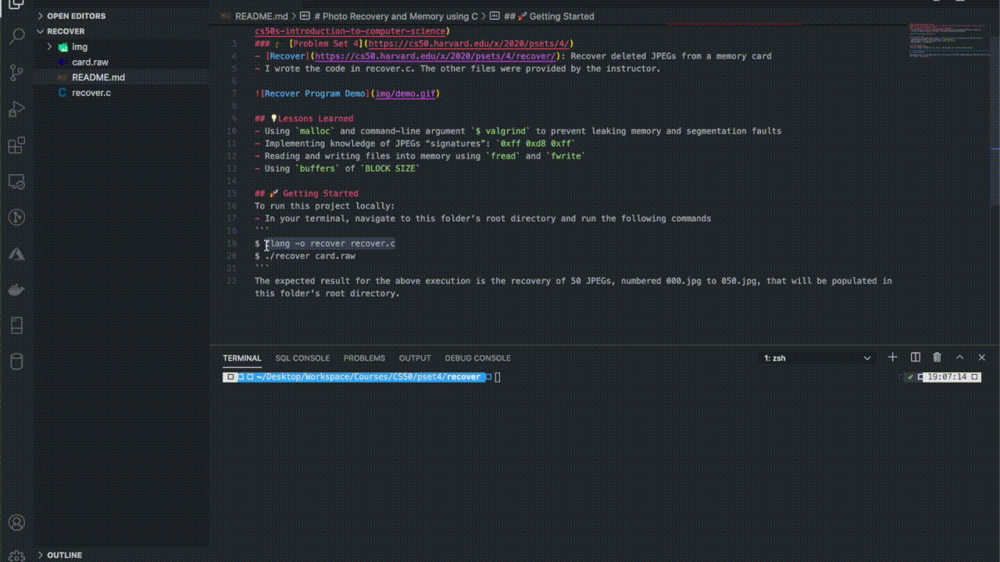

# Photo Recovery and Memory using C
### Homework from [Harvard's Introduction to Computer Science CS50 hosted on eDX](https://www.edx.org/course/cs50s-introduction-to-computer-science)
### 🎓 [Problem Set 4](https://cs50.harvard.edu/x/2020/psets/4/)
- [Recover](https://cs50.harvard.edu/x/2020/psets/4/recover/): Recover deleted JPEGs from a memory card.
- I wrote the code in recover.c. The other files were provided by the instructor.



## 💡Lessons Learned
- Using `malloc` and command-line argument `$ valgrind` to prevent leaking memory and segmentation faults
- Implementing knowledge of JPEGs “signatures”: `0xff 0xd8 0xff`
- Reading and writing files into memory using `fread` and `fwrite`
- Using `buffers` of `BLOCK SIZE`

## 🚀 Getting Started
To run this project locally:
- In your terminal, navigate to this folder's root directory and run the following commands
```
$ clang -o recover recover.c
$ ./recover card.raw
```
The expected result for the above execution is the recovery of 50 JPEGs, numbered 000.jpg to 050.jpg, that will be populated in this folder's root directory.